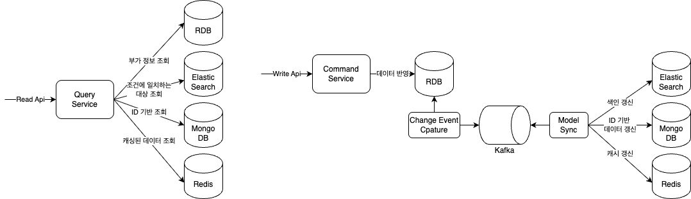
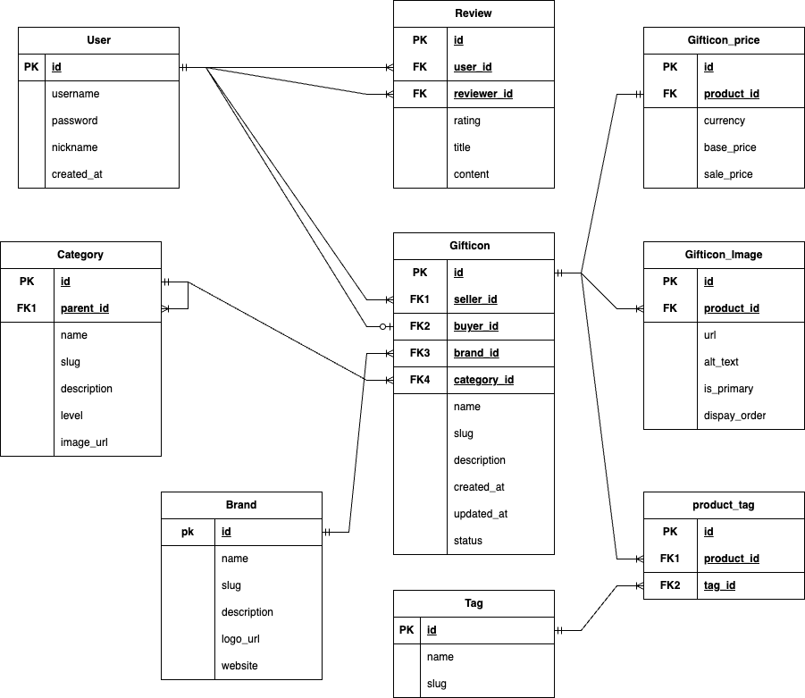

# gifticon_trader_cqrs
CQRS를 적용한 기프티콘 거래 서비스

----

## 1. 개요
- 기프티콘 거래 서비스는 기프티콘을 사고 파는 플랫폼을 간단하게 구현
- CQRS와 Kafka, CDC를 활용하여 기프티콘 이벤트를 실시간으로 처리

### 1-1. Why CQRS(Command Query Responsibility Segregation) ?
- CQRS는 명령(쓰기)과 조회(읽기)를 분리하여 각 작업에 최적화된 모델을 사용
- 장점
  - 도메인 책임의 명확한 분리
    - Command : 비즈니스 규칙과 상태변화
    - Query : 데이터 조회와 최적화
  - 확장성과 장애 격리 구조
- 단점
  - 시스템 복잡도 증가
    - 테스트 및 디버깅 어려움
    - 개발 & 인프라 비용 증가
  - 일관성 문제
    - 최신데이터가 보장되지 않을 수 있음

### 1-2. Why Kafka?
- 복잡한 시스템 간의 데이터 흐름을 안정적이고 확장 가능한 구조로 설계하기 위해 Kafka를 선택 
- Kafka는 단순한 메시지 브로커가 아닌, 시스템 전반의 비동기적 데이터 흐름과 이벤트 기반 아키텍처를 지탱하는 핵심 허브로 기능 
- 고가용성, 메시지 재처리, Consumer 그룹 기반 확장성과 CDC 및 CQRS 아키텍처와의 높은 호환성을 제공


### 1-3. Why CDC(Change Data Capture) ?
- 이벤트 소싱은 이론적으로 매력적이지만 실제로는 구현 비용이 크고 운영 리스크가 존재
- Kafka CDC는 이벤트 소싱이 제공하는 이벤트 흐름 기반의 아키텍처 장점은 유지하면서, 기존 RDB 기반의 인프라와 호환성을 유지 가능
  - Database WAL (Write Ahead Log)를 활용하여 데이터 변경 이벤트를 캡처하고, 이를 Kafka로 전송


### 1-4. System Architecture


### 1-5. ERD


### 1-6. 참고사항
- MVP 성격의 프로젝트이므로 인증 및 보안은 구현 생략

### 1-7. 프로젝트 구조
```
com.mkhwang.gifticon
├── common
├── command
│   ├── gifticon
│   │   ├── application
│   │   │   ├── command
│   │   │   ├── mapper
│   │   │   ├── service
│   │   │   └── uesecase
│   │   ├── domain
│   │   ├── infra
│   │   └── presentation
│   │       ├── dto
│   │       └── mapper
│   ├── review
│   │   └── ...
│   ├── tag
│   │   └── ...
├── query
│   ├── gifticon
│   │   ├── application
│   │   │   ├── mapper
│   │   │   └── search
│   │   ├── domain
│   │   ├── infra
│   │   └── presentation
│   │       ├── dto
│   │       └── mapper
│   ├── brand
│   │   └── ...
│   ├── category
│   │   └── ...
│   ├── review
│   │   └── ...
│   ├── user
│   │   └── ...
└── sync
    └── handler
        ├── cache
        ├── document
        ├── dto
        └── search

```

## 2. 시나리오

### 2-1. 기프티콘 등록
- 사용자가 기프티콘 판매 등록  
  → Command 모델에서 PostgreSQL에 저장  
  → Debezium이 WAL에서 이벤트 감지  
  → Kafka로 이벤트 전송  
  → Elasticsearch 및 MongoDB에 조회용 문서 생성

### 2-2. 기프티콘 상태 변경
- 기프티콘 판매 완료, 사용 처리 등 상태 변경  
  → Command 모델에서 DB 업데이트  
  → CDC로 Kafka 이벤트 전송  
  → Elasticsearch / MongoDB의 도큐먼트 갱신

### 2-3. 리뷰 작성
- 리뷰 작성 후 Command DB 저장  
  → CDC를 통해 Kafka 이벤트 발행  
  → 리뷰 점수 계산  
  → 사용자 평점 Redis에 캐싱

## 3. 사용 기술 스택
- **Backend**: Spring Boot, Spring Data JPA, QueryDSL
- **Database**: PostgreSQL (Command), MongoDB & Elasticsearch (Query), Redis (Cache)
- **Messaging / Stream**: Apache Kafka, Debezium (CDC)
- **Infra**: Docker, Docker Compose
- **Monitoring**: Prometheus, Grafana
- **Testing**: JUnit, Mockito, K6 (부하 테스트)

## 4. 부하테스트 Report
- [롹인하기](./k6/README.md)

## 5. 향후 개선 방향
- multi project로 분리하여 모듈화 
  - 공통모듈, command, query, sync 를 각각 모듈로 분리 → 개별 배포 가능 → 확장성 및 유지보수성 향상