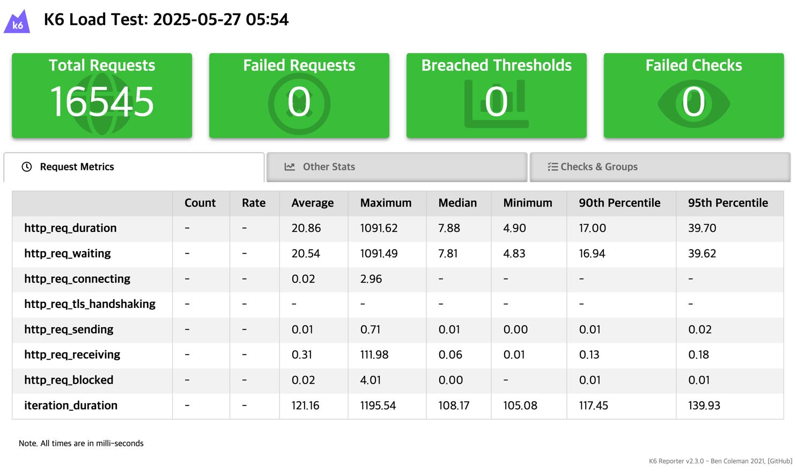
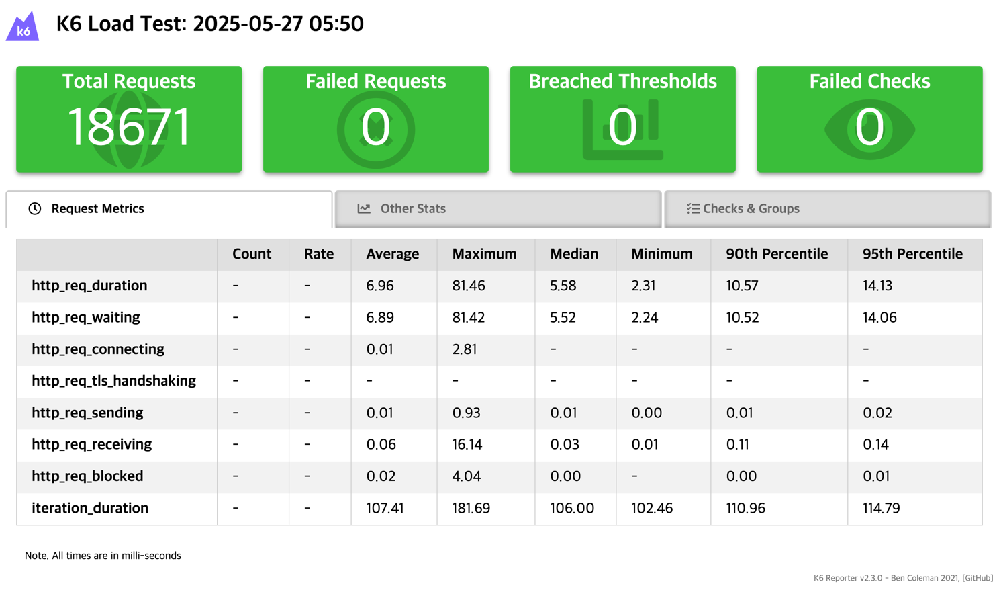
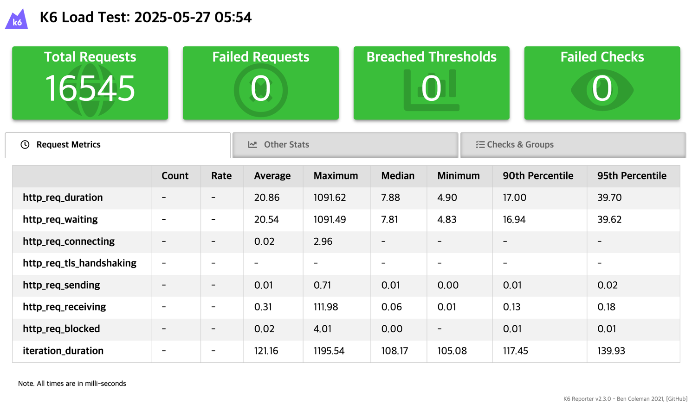

# 부하테스트 Report

## 1. 개요
- CQRS 적용을통해 ElasticSearch, MongoDB, Redis 를 이용해 최적화한 Query 성능과, 기존 JPA 기반의 Query 성능을 비교하기 위한 부하테스트를 진행

## 2. 테스트 환경
- 테스트 환경: 로컬 개발 환경
  - OS: macOS
  - CPU: Apple M1 Pro
  - RAM: 32GB
- 테스트 도구: K6
- 데이터
  - 카테고리 : 60 개
  - 브랜드 : 100 개
  - 기프티콘 : 10,000 개
    - 기프티콘 이미지 : 약 30,000 개
  - 태그 : 약 700 개
  - 사용자 : 1,000 명
  - 리뷰 : 약 4,000 개

## 3. 테스트 시나리오
### 3-1. 기프티콘 목록 조회
- 기프티콘 목록 무작위 조건 조회
- 가상 사용자 수: 100명
- 테스트 시간: 20초

 *JPA 기반 목록 조회 성능*

 *CQRS 기반 목록 조회 성능*

### 3-2. 기프티콘 상세 조회
- 기프티콘 상세 조회 API 무작위 조건 조회
- 가상 사용자 수: 100명
- 테스트 시간: 20초

 *JPA 기반 상세 조회 성능*

 *CQRS 기반 상세 조회 성능*

## 4. 결과 분석

CQRS 기반 조회 성능이 JPA 기반 조회 성능에 안정적인 성능을 보임을 확인할 수 있다.

### 4-1. 동일한 조건에서 부하테스트를 진행했음에도 total request 수가 다른 이유 ?
- `sleep(0.1)` 을 통해 각 가상 사용자들이 0.1초의 딜레이를 가지도록 했지만 요청 처리 시간이 네트워크 상황, 서버 상태 등에 따라 ± 몇 ms 차이가 나면 총 반복 횟수가 달라질 수 있다
- 각 http.get() 요청의 응답 시간이 매번 달라질 수 있기 때문에 동일시간 내 요청수가 달라질 수 있다
- 시스템 부하에 따라 요청 처리 시간이 달라질 수 있다

## 5. 결론
- JPA 기반의 조회 성능보다 다양한 인프라와 최적화를 통한 CQRS 기반의 조회 성능이 안정적이고 우수한것은 당연하다.
- 하지만, 다양한 인프라를 사용하는 만큼 개발비용과 유지보수비용이 상대적으로 증가할 수 있다.
- 따라서, 무조건 CQRS 를 선택할 것이 아니라, 서비스의 규모와 요구사항에 따라 적절한 아키텍처를 선택하는 것이 중요하다.